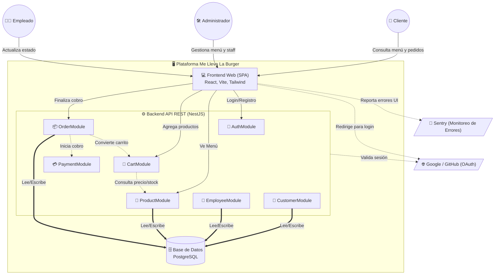

```mermaid
flowchart TB
    %% Usuarios
    cliente(("👤 Cliente"))
    admin(("🛠️ Administrador"))
    empleado(("👨‍🍳 Empleado"))

    %% Sistemas Externos
    oauth[/"🌐 Google / GitHub (OAuth)"/]
    sentry[/"🐛 Sentry (Monitoreo de Errores)"/]

    %% El Sistema Principal
    subgraph MLLB ["🖥️ Plataforma Me Lleva La Burger"]
        
        spa["💻 Frontend Web (SPA)\nReact, Vite, Tailwind"]
        db[("🗄️ Base de Datos\nPostgreSQL")]

        subgraph Backend ["⚙️ Backend API REST (NestJS)"]
            auth["🔐 AuthModule"]
            customer["👤 CustomerModule"]
            employee["👷 EmployeeModule"]
            product["🍔 ProductModule"]
            cart["🛒 CartModule"]
            order["📦 OrderModule"]
            payment["💳 PaymentModule"]
        end
    end

    %% Relaciones de Usuarios a Frontend
    cliente -->|Consulta menú y pedidos| spa
    admin -->|Gestiona menú y staff| spa
    empleado -->|Actualiza estado| spa

    %% Relaciones de Frontend a Módulos del Backend
    spa -->|Login/Registro| auth
    spa -->|Ve Menú| product
    spa -->|Agrega productos| cart
    spa -->|Finaliza cobro| order

    %% Relaciones Internas del Backend
    cart -.->|Consulta precio/stock| product
    order -.->|Convierte carrito| cart
    order -.->|Inicia cobro| payment

    %% Relaciones a Sistemas Externos
    spa -.->|Redirige para login| oauth
    Backend -.->|Valida sesión| oauth
    spa -.->|Reporta errores UI| sentry

    %% Relaciones a Base de Datos
    customer ==>|Lee/Escribe| db
    employee ==>|Lee/Escribe| db
    product ==>|Lee/Escribe| db
    order ==>|Lee/Escribe| db
```
